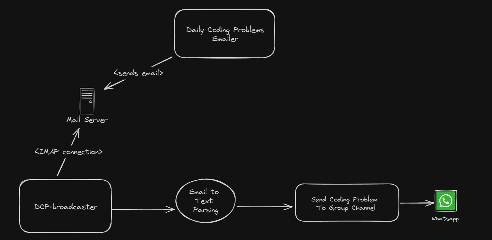

# dcp-broadcaster
Application to monitor coding daily problems received by email and broadcast to users using messaging apps

#### Basic Application Understanding

#### Dependencies
- go 1.23 (Use gvm to make it easir changing versions on the fly)
- air (development only)
- Postgres 16
- Metabase (For reports)
- Migrate CLI Tool latest (github.com/golang-migrate/migrate)

### PRODUCTION ENVIRONMENT
- whatsapp-api-sevice (Fly.io)
- Postgres (Supabase)
- DCP-Worker (Local Docker Container)